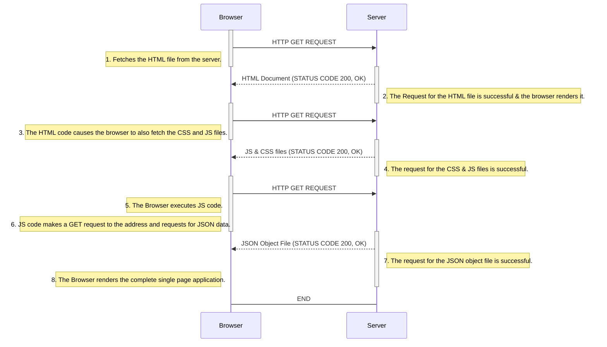

# 0.5: Single page app diagram

This diagram depicts the situation where the user goes to the [single-page app version of the notes app](https://studies.cs.helsinki.fi/exampleapp/spa)

```mermaid
sequenceDiagram;
participant Browser
participant Server

activate Browser

Browser ->> Server: HTTP GET REQUEST 

Note left of Browser: 1. Fetches the HTML file from the server.

deactivate Browser
activate Server

Server -->> Browser: HTML Document (STATUS CODE 200, OK)

Note right of Server: 2. The Request for the HTML file is successful & the browser renders it.

deactivate Server
activate Browser

Browser ->> Server: HTTP GET REQUEST

Note left of Browser: 3. The HTML code causes the browser to also fetch the CSS and JS files.

deactivate Browser
activate Server

Server -->> Browser: JS & CSS files (STATUS CODE 200, OK)

Note right of Server: 4. The request for the CSS & JS files is successful.

deactivate Server
activate Browser

Browser ->> Server: HTTP GET REQUEST

Note left of Browser: 5. The Browser executes JS code.
Note left of Browser: 6. JS code makes a GET request to the address and requests for JSON data.

deactivate Browser
activate Server

Server -->> Browser: JSON Object File (STATUS CODE 200, OK)

Note right of Server: 7. The request for the JSON object file is successful.
Note left of Browser: 8. The Browser renders the complete single page application.

deactivate Server

Browser -> Server: END
```
