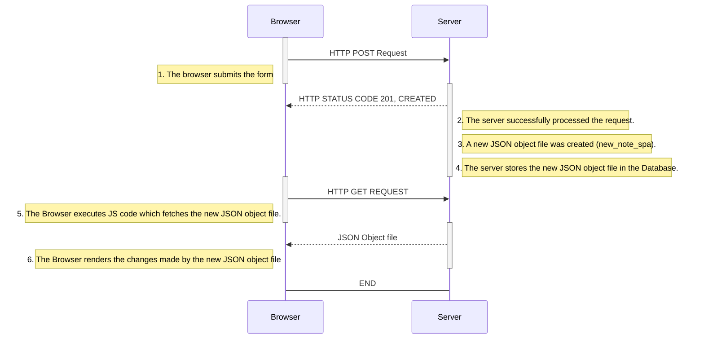

# 0.6: New note in Single page app diagram

This diagram depicts the situation where the user creates a new note using the [single-page version of the app](https://studies.cs.helsinki.fi/exampleapp/spa).

