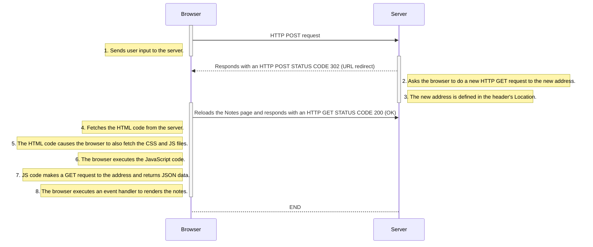

# HTTP POST

This is what happens when a user creates a new note on [the page](https://studies.cs.helsinki.fi/exampleapp/notes) by writing something into the text field and clicking the save button.

