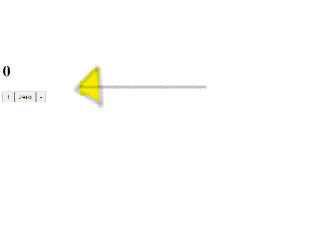

# A Counter App

The counter app is a dynamic web app that utilizes React Hooks and state management.

## How it Works

It has three buttons:

* ```+```: adds 1 to the counter.
* ```-```: subtracts 1 from the counter.
* ```0```: resets the counter to its default state, i.e: 0.


